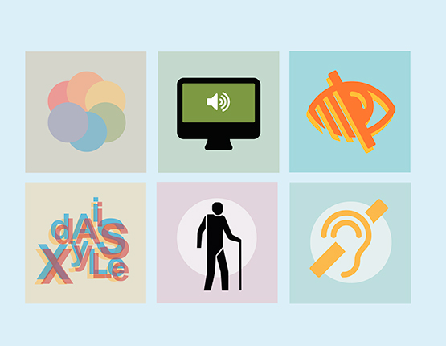

% La accesibilidad de las imágenes en la web
% Mario Zapata Palazón
% Marzo 2024

# Información general

* Las imágenes y los gráficos hacen que los contenidos de una web resulten más agradables y fáciles de entender para muchas personas y, en particular, para quienes padecen discapacidades cognitivas y de aprendizaje.

# Información general

* Sirven como pistas que utilizan las personas con deficiencias visuales, incluidas las personas con baja visión, para orientarse en el contenido.

\centering

{ width=35% }\ 

# Beneficios

* Las imágenes accesibles son beneficiosas en muchas situaciones, por ejemplo:

* **Personas que utilizan lectores de pantalla:**
* El texto alternativo puede leerse en voz alta o en Braille.

# Beneficios

* **Personas que utilizan software de entrada de voz:**
* Los usuarios pueden enfocar un botón o una imagen vinculada con un solo comando de voz.

\centering

{ width=40% }\ 

# Beneficios

* **Personas que navegan por sitios web con voz:**
* La alternativa de texto puede leerse en voz alta

* **Usuarios de web móvil:**
* Las imágenes pueden desactivarse, especialmente en itinerancia de datos.

* **Optimización de motores de búsqueda:**
* Los motores de búsqueda indexan las imágenes.

# Principios básicos

::: {.columns}

:::: {.column }

* Toda imagen debe tener un atributo **alt**.
* El texto alternativo **(alt-text)** puede proporcionarse en el **"atributo alt"** o en el contexto circundante de la imagen.
* El texto alternativo apropiado depende en gran medida del contexto de la imagen.

::::

:::: {.column }

\vspace{0.4cm}

\centering

{ width=120% }\ 

:::: 

:::

# Principios básicos

::: {.columns}

:::: {.column }

* Las imágenes decorativas siguen necesitando un atributo alt, pero debe ser **null alt=""**.
* El texto alternativo debe ser sucinto y no contener las frases **"imágenes de..."** o **"gráfico de..."**.

::::

:::: {.column }

\vspace{0.4cm}

\centering

{ width=160% }\ 

:::: 

:::

# Tipos de imágenes
El tipo de información que proporcione en el texto alternativo se basa en la finalidad de la imagen. A continuación, veremos los tipos de imágenes más frecuentes.

# Tipos de imágenes

**Imágenes informativas**

* Imágenes que representan gráficamente conceptos e información, normalmente cuadros, fotos e ilustraciones. El texto alternativo debe ser al menos una breve descripción que transmita la información esencial presentada por la imagen.

# Tipos de imágenes

**Imágenes decorativas**

* Proporcione una alternativa de texto nulo (alt="") cuando el único propósito de una imagen sea añadir decoración visual a la página, en lugar de transmitir información importante para la comprensión de la página.

# Tipos de imágenes

**Imágenes funcionales**

* La alternativa de texto de una imagen utilizada como enlace o como botón debe describir la funcionalidad del enlace o del botón más que la imagen visual. Ejemplos de este tipo de imágenes son un icono de impresora para representar la función de impresión o un botón para enviar un formulario.

# Tipos de imágenes

**Imágenes de texto**

* A veces se presenta texto legible dentro de una imagen. Si la imagen no es un logotipo, evite el texto en imágenes. Sin embargo, si se utilizan imágenes de texto, la alternativa de texto debe contener las mismas palabras que en la imagen.

# Tipos de imágenes

**Imágenes complejas: como gráficos y diagramas**

* Para transmitir datos o información detallada, proporcione como alternativa de texto un equivalente en texto completo de los datos o la información proporcionados en la imagen.

# Tipos de imágenes

**Grupos de imágenes**

* Si varias imágenes transmiten una misma información, la alternativa de texto para una imagen debe transmitir la información de todo el grupo.

# Tipos de imágenes

**Mapas de imágenes**

* La alternativa de texto para una imagen que contiene múltiples áreas sobre las que se puede hacer clic debe proporcionar un contexto general para el conjunto de enlaces. Además, cada área sobre la que se pueda hacer clic debe tener un texto alternativo que describa la finalidad o el destino del enlace.

# Más información

* Para encontrar más información, explicada al detalle, puedes visitar los siguientes enlaces:

* [The City University of New York](https://guides.cuny.edu/accessibility/images)

* [Web Accessibility Initiative](https://www.w3.org/WAI/tutorials/images/)
